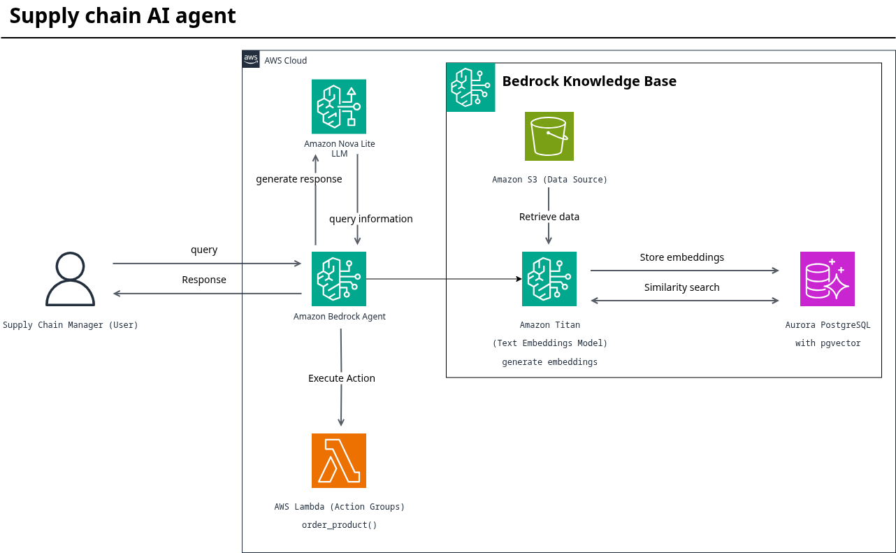

# **Supply Chain AI Agent Assistant**

## **1. Overview**

The Supply Chain AI Agent Assistant is an intelligent, generative AI-powered application designed to support supply chain managers. It leverages Amazon Bedrock to understand complex natural language queries and provide accurate, context-aware answers by drawing from a curated knowledge base and executing specific operational tasks. This agent automates information retrieval, provides data-driven insights, and helps in decision-making processes, significantly improving operational efficiency.

## **2. System Architecture**

The solution is built on a serverless AWS architecture, ensuring scalability, cost-effectiveness, and high availability. The core components and their interactions are depicted below and described in the following sections.

## **3. Core Components & Services**

### **3.1. Amazon Bedrock Agent**
*   **Role:** The central orchestration brain of the application.
*   **Function:** Interprets user prompts, determines user intent, and decides whether to query the Knowledge Base, invoke a Lambda function, or perform a direct reasoning task using the **Amazon Nova Lite** foundation model.
*   **Model:** **Amazon Nova Lite** is used for its optimal balance of high intelligence, fast response times, and cost-efficiency for a conversational agent.

### **3.2. Amazon Bedrock Knowledge Base**
*   **Role:** Provides the agent with long-term memory and factual grounding using the company's proprietary supply chain data.
*   **Data Source:** **Amazon S3** bucket containing supply chain documents (e.g., SOPs, inventory reports, supplier manuals, logistics contracts).
*   **Vector Store:** **Amazon Aurora PostgreSQL** with the **pgvector** extension. This stores the vector embeddings of the source documents, enabling efficient and accurate semantic search.
*   **Embeddings Model:** **Amazon Titan Text Embeddings** model is used to convert the text from the S3 documents into high-dimensional vector representations.

### **3.3. AWS Lambda (Action Groups)**
*   **Role:** Serves as the "action" arm of the agent, allowing it to perform real-time tasks and retrieve live data from external systems.
*   **Function:** When the agent determines a user query requires an action (e.g., "What is the current stock level for product X?"), it invokes a specific Lambda function. These functions are custom-coded to interact with databases, APIs, or other AWS services to fetch or manipulate data.

### **3.4. Infrastructure as Code (IaC) with Terraform**
*   **Role:** Provides a repeatable, version-controlled, and automated deployment process for the entire project.
*   **Function:** All AWS resources (Bedrock Agent, Knowledge Base, Lambda functions, IAM roles, S3 bucket, Aurora database) are defined and provisioned using Terraform configurations. This ensures environment consistency and simplifies management and scaling.

## **4. How It Works: Data and Query Flow**

### **A. Knowledge Base Ingestion Flow**
1.  Supply chain documents (PDFs, DOCs, TXT) are uploaded to the designated S3 bucket.
2.  The Bedrock Knowledge Base is triggered, chunking the documents into manageable pieces.
3.  The **Titan Text Embeddings** model converts each text chunk into a vector.
4.  These vectors, along with their source text metadata, are stored in the **Aurora PostgreSQL (pgvector)** database.

### **B. User Query Flow**
1.  A Supply Chain Manager asks a question like, "What is the standard lead time for our top supplier, and what is our current inventory for their key component?"
2.  The **Bedrock Agent** receives the query and uses the **Nova Lite** model to reason about the intent.
3.  The agent breaks down the query, recognizing it needs both knowledge retrieval and a live data check.
4.  **For "standard lead time":** The agent queries the **Knowledge Base**. The Knowledge Base performs a semantic search in the **pgvector** store to find the most relevant information from the supplier manuals and returns it.
5.  **For "current inventory":** The agent determines it needs live data and invokes the corresponding **Lambda function**. The function queries the inventory management database and returns the result.
6.  The Bedrock Agent synthesizes the information from both sources into a coherent, natural language response and presents it to the user.

---
